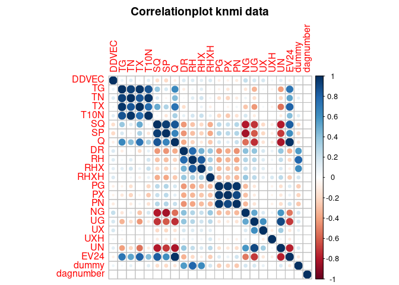
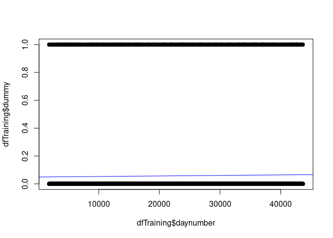
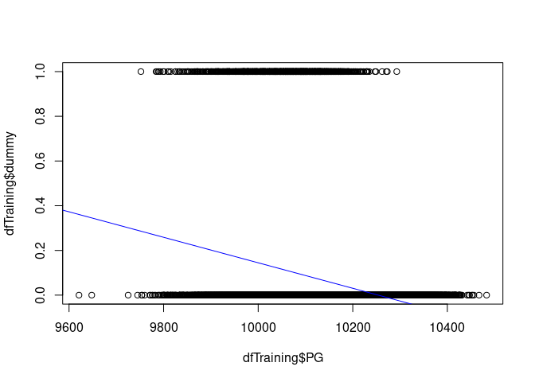
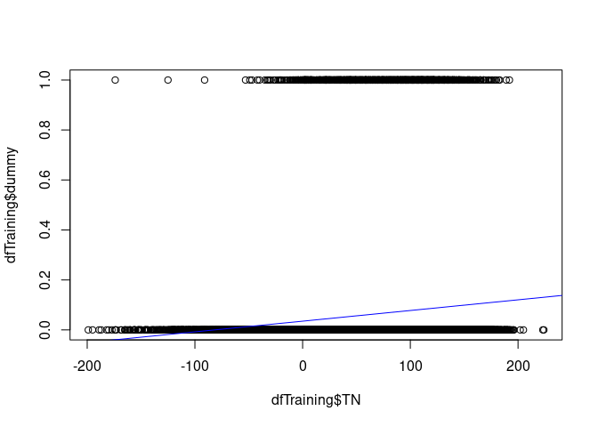

Methodology for Premasters DSS
================
# Group 17  
Bart Kuipers - 2085029  
Daniel Noumon - 2076640  
Joël van Run -2082698  
Mehmet Bakirci – 208610  
Lieke Buuron – 2082095  

## 17-11-2021

# Initial data import and manipulation

``` r
KNMI_20200710 <- read.csv("KNMI_20200710.csv", header= TRUE)
library(psych)
install.packages("lubridate")
library(lubridate)
head(KNMI_20200710)
```

    ##   STN YYYYMMDD DDVEC FHVEC FG FHX FHXH FHN FHNH FXX FXXH   TG   TN TNH  TX TXH
    ## 1 260 19010101    NA    NA NA  NA   NA  NA   NA  NA   NA  -49  -65  NA -24  NA
    ## 2 260 19010102    NA    NA NA  NA   NA  NA   NA  NA   NA  -18  -33  NA -14  NA
    ## 3 260 19010103    NA    NA NA  NA   NA  NA   NA  NA   NA  -26  -76  NA  -6  NA
    ## 4 260 19010104    NA    NA NA  NA   NA  NA   NA  NA   NA  -65  -90  NA -11  NA
    ## 5 260 19010105    NA    NA NA  NA   NA  NA   NA  NA   NA  -60  -82  NA -20  NA
    ## 6 260 19010106    NA    NA NA  NA   NA  NA   NA  NA   NA -100 -114  NA -80  NA
    ##   T10N T10NH SQ SP  Q DR RH RHX RHXH PG PX PXH PN PNH VVN VVNH VVX VVXH NG UG
    ## 1   NA    NA 28 36 NA NA NA  NA   NA NA NA  NA NA  NA  NA   NA  NA   NA NA 66
    ## 2   NA    NA  0  0 NA NA NA  NA   NA NA NA  NA NA  NA  NA   NA  NA   NA NA 86
    ## 3   NA    NA  0  0 NA NA NA  NA   NA NA NA  NA NA  NA  NA   NA  NA   NA NA 89
    ## 4   NA    NA  0  0 NA NA NA  NA   NA NA NA  NA NA  NA  NA   NA  NA   NA NA 79
    ## 5   NA    NA 36 46 NA NA NA  NA   NA NA NA  NA NA  NA  NA   NA  NA   NA NA 65
    ## 6   NA    NA 61 77 NA NA NA  NA   NA NA NA  NA NA  NA  NA   NA  NA   NA NA 63
    ##   UX UXH UN UNH EV24
    ## 1 NA  NA NA  NA   NA
    ## 2 NA  NA NA  NA   NA
    ## 3 NA  NA NA  NA   NA
    ## 4 NA  NA NA  NA   NA
    ## 5 NA  NA NA  NA   NA
    ## 6 NA  NA NA  NA   NA

``` r
KNMI_20200710$daynumber <- c(1:43656)
knmi <- KNMI_20200710
set.seed(123)
knmi$YYYYMMDD <-ymd(knmi$YYYYMMDD)


knmi$STN <- NULL
knmi$FHVEC<- NULL
knmi$FG<- NULL
knmi$FHX<- NULL
knmi$FHXH<- NULL
knmi$FHN<- NULL
knmi$FHNH<- NULL
knmi$FXX<- NULL
knmi$FXXH<- NULL
knmi$TNH<- NULL
knmi$TXH<- NULL
knmi$T10NH<- NULL
knmi$PXH<- NULL
knmi$PNH<- NULL
knmi$VVN<- NULL
knmi$VVNH<- NULL
knmi$VVX<- NULL
knmi$VVXH<- NULL
knmi$UXN<- NULL
knmi$UNH<- NULL


knmi <- knmi[!is.na(knmi$RH),]
knmi$dummy <- ifelse (knmi$RH > 100, 1, 0) 
head(knmi)
```
    ##        YYYYMMDD DDVEC  TG  TN  TX T10N SQ SP  Q DR  RH RHX RHXH    PG    PX
    ## 1827 1906-01-01   112 -32 -70  -3   NA 54 69 NA NA   0   0   NA 10235 10274
    ## 1828 1906-01-02   122 -23 -44  -8   NA 26 33 NA NA   0   0   NA 10187 10226
    ## 1829 1906-01-03   142   7 -36  46   NA  1  1 NA NA   0   0   NA 10099 10122
    ## 1830 1906-01-04   174  65  46  80   NA  0  0 NA NA  36  15   NA 10111 10120
    ## 1831 1906-01-05   239  71  29  90   NA  0  0 NA NA 134  31   NA 10094 10146
    ## 1832 1906-01-06   218  73  46 109   NA 12 15 NA NA 136  17   NA  9978 10134
    ##         PN NG UG UX UXH UN EV24 daynumber dummy
    ## 1827 10215 NA 51 NA  NA NA   NA      1827     0
    ## 1828 10130 NA 61 NA  NA NA   NA      1828     0
    ## 1829 10086 NA 77 NA  NA NA   NA      1829     0
    ## 1830 10091 NA 95 NA  NA NA   NA      1830     0
    ## 1831 10043 NA 94 NA  NA NA   NA      1831     1
    ## 1832  9911 NA 81 NA  NA NA   NA      1832     1

``` r
knmi <- knmi[sample(nrow(knmi)),]
```

# Generating the Correlation plot

``` r
knmicorr <- knmi
knmicorr$YYYYMMDD <- NULL
knmicorr$year <- NULL
knmicorr$dagnumber <- c(1:41800)
knmicorr$daynumber <- NULL

KNMI_20200710$YYYYMMDD <- c(1:43656)
knmicorrelatie <- cor(knmicorr, use="complete.obs")

install.packages("corrplot")
library(corrplot)

    ## corrplot 0.91 loaded

corrplot(knmicorrelatie,
         title = "Correlationplot knmi data",
         mar = c(0, 0, 2, 0))
```

<!-- -->

``` r
fractionTraining   <- 0.60
fractionValidation <- 0.20
fractionTest       <- 0.20

sampleSizeTraining   <- floor(fractionTraining   * nrow(knmi))
sampleSizeValidation <- floor(fractionValidation * nrow(knmi))
sampleSizeTest       <- floor(fractionTest       * nrow(knmi))

indicesTraining    <- sort(sample(seq_len(nrow(knmi)), size=sampleSizeTraining))
indicesNotTraining <- setdiff(seq_len(nrow(knmi)), indicesTraining)
indicesValidation  <- sort(sample(indicesNotTraining, size=sampleSizeValidation))
indicesTest        <- setdiff(indicesNotTraining, indicesValidation)

dfTraining   <- knmi[indicesTraining, ]
dfValidation <- knmi[indicesValidation, ]
dfTest       <- knmi[indicesTest, ]
```

# Test training set on variable daynumber

## MODEL 0

``` r
plot(dfTraining$daynumber, dfTraining$dummy)
abline(lm(dfTraining$dummy ~ dfTraining$daynumber, data = dfTraining), col = "blue")
```

<!-- -->

``` r
m0 <- lm(dfTraining$dummy ~ dfTraining$daynumber)

m0
```

    ## 
    ## Call:
    ## lm(formula = dfTraining$dummy ~ dfTraining$daynumber)
    ## 
    ## Coefficients:
    ##          (Intercept)  dfTraining$daynumber  
    ##            4.938e-02             3.762e-07

``` r
dfValidation$m0 <- 4.938e-02 + dfValidation$daynumber * 3.762e-07

dfValidation$m0sq <- (dfValidation$m0 - dfValidation$dummy)^2
m0sq <- sum(dfValidation$m0sq)
m0sq
```

    ## [1] 434.367

## MODEL 1

``` r
plot(dfTraining$PG, dfTraining$dummy)
abline(lm(dfTraining$dummy ~ dfTraining$PG, data = dfTraining), col = "blue")
```

<!-- -->

``` r
m1 <- lm(dfTraining$dummy ~ dfTraining$PG)

m1
```

    ## 
    ## Call:
    ## lm(formula = dfTraining$dummy ~ dfTraining$PG)
    ## 
    ## Coefficients:
    ##   (Intercept)  dfTraining$PG  
    ##     5.8461357     -0.0005702

``` r
dfValidation$m1 <- 5.8461357 + dfValidation$PG*-0.0005702 

dfValidation$m1sq <- (dfValidation$m1 - dfValidation$dummy)^2

m1sq <- sum(dfValidation$m1sq)
m1sq
```

    ## [1] 411.651

## MODEL 2

``` r
plot(dfTraining$TN, dfTraining$dummy)
abline(lm(dfTraining$dummy ~ dfTraining$TN, data = dfTraining), col = "blue")
```

<!-- -->

``` r
m2 <- lm(dfTraining$dummy ~ dfTraining$TN)

m2
```

    ## 
    ## Call:
    ## lm(formula = dfTraining$dummy ~ dfTraining$TN)
    ## 
    ## Coefficients:
    ##   (Intercept)  dfTraining$TN  
    ##     0.0350206      0.0004272

``` r
dfValidation$m2 <- 0.0350206 + dfValidation$TN*0.0004272

dfValidation$m2sq <- (dfValidation$m2 - dfValidation$dummy)^2
m2sq <- sum(dfValidation$m2sq)
m2sq
```

    ## [1] 430.3193

``` r
m1
```

    ## 
    ## Call:
    ## lm(formula = dfTraining$dummy ~ dfTraining$PG)
    ## 
    ## Coefficients:
    ##   (Intercept)  dfTraining$PG  
    ##     5.8461357     -0.0005702

``` r
dfTest$m1 <- 5.8461357 + dfValidation$PG*-0.0005702

dfTest$m1sq <- (dfTest$m1 - dfTest$dummy)^2
m1sqtest <- sum(dfTest$m1sq)
m1sqtest
```

    ## [1] 469.4157

``` r
head(dfTest)
```

    ##         YYYYMMDD DDVEC  TG  TN  TX T10N SQ SP   Q DR RH RHX RHXH    PG    PX
    ## 39385 2008-10-30    63  26 -19  66  -43 35 36 471  0 -1  -1    1 10001 10026
    ## 33169 1991-10-24   293 101  87 125   85  0  0 226  0 -1  -1   NA 10276 10296
    ## 11152 1931-07-14   167 155 104 201   NA 68 42  NA 10 54  23   NA 10068 10096
    ## 13875 1938-12-27   260  15 -47  48   NA  1  1  NA 39 51  14   NA 10099 10175
    ## 17006 1947-07-24   331 205 149 260   NA 89 56  NA  0  1   1   NA 10198 10208
    ## 34462 1995-05-09   293  95  81 116   71 14  9 946 42 37  12   12 10152 10176
    ##          PN NG UG  UX UXH UN EV24 daynumber dummy         m1         m1sq
    ## 39385  9983  6 93 100   1 81    5     39385     0  0.1395741 1.948093e-02
    ## 33169 10266  7 89  96  21 82    3     33169     0  0.0797031 6.352584e-03
    ## 11152 10015 NA 80  NA  NA NA   NA     11152     0  0.1036515 1.074363e-02
    ## 13875 10056 NA 96  NA  NA NA   NA     13875     0  0.0694395 4.821844e-03
    ## 17006 10180 NA 68  NA  NA NA   NA     17006     0 -0.0092481 8.552735e-05
    ## 34462 10116  7 85  95   2 74   14     34462     0  0.1635225 2.673961e-02

``` r
dfTest$dummyavg <- mean(dfTraining$dummy)
dfTest$seavg <- (dfTest$dummyavg - dfTest$dummy)^2
sum(dfTest$seavg)
```

    ## [1] 442.7182

``` r
m0
```

    ## 
    ## Call:
    ## lm(formula = dfTraining$dummy ~ dfTraining$daynumber)
    ## 
    ## Coefficients:
    ##          (Intercept)  dfTraining$daynumber  
    ##            4.938e-02             3.762e-07

``` r
dfTest$m0 <- 4.938e-02 + dfValidation$daynumber*-3.762e-07

dfTest$m0sq <- (dfTest$m0 - dfTest$dummy)^2
m0sqtest <- sum(dfTest$m0sq)
m0sqtest
```

    ## [1] 444.7274

``` r
head(dfTest)
```

    ##         YYYYMMDD DDVEC  TG  TN  TX T10N SQ SP   Q DR RH RHX RHXH    PG    PX
    ## 39385 2008-10-30    63  26 -19  66  -43 35 36 471  0 -1  -1    1 10001 10026
    ## 33169 1991-10-24   293 101  87 125   85  0  0 226  0 -1  -1   NA 10276 10296
    ## 11152 1931-07-14   167 155 104 201   NA 68 42  NA 10 54  23   NA 10068 10096
    ## 13875 1938-12-27   260  15 -47  48   NA  1  1  NA 39 51  14   NA 10099 10175
    ## 17006 1947-07-24   331 205 149 260   NA 89 56  NA  0  1   1   NA 10198 10208
    ## 34462 1995-05-09   293  95  81 116   71 14  9 946 42 37  12   12 10152 10176
    ##          PN NG UG  UX UXH UN EV24 daynumber dummy         m1         m1sq
    ## 39385  9983  6 93 100   1 81    5     39385     0  0.1395741 1.948093e-02
    ## 33169 10266  7 89  96  21 82    3     33169     0  0.0797031 6.352584e-03
    ## 11152 10015 NA 80  NA  NA NA   NA     11152     0  0.1036515 1.074363e-02
    ## 13875 10056 NA 96  NA  NA NA   NA     13875     0  0.0694395 4.821844e-03
    ## 17006 10180 NA 68  NA  NA NA   NA     17006     0 -0.0092481 8.552735e-05
    ## 34462 10116  7 85  95   2 74   14     34462     0  0.1635225 2.673961e-02
    ##         dummyavg       seavg         m0        m0sq
    ## 39385 0.05797448 0.003361041 0.04756973 0.002262879
    ## 33169 0.05797448 0.003361041 0.03846117 0.001479262
    ## 11152 0.05797448 0.003361041 0.04360082 0.001901031
    ## 13875 0.05797448 0.003361041 0.03944945 0.001556259
    ## 17006 0.05797448 0.003361041 0.03783781 0.001431700
    ## 34462 0.05797448 0.003361041 0.04867763 0.002369512

``` r
dfTest$dummyavg <- mean(dfTraining$dummy)
dfTest$seavg <- (dfTest$dummyavg - dfTest$dummy)^2
sum(dfTest$seavg)
```

    ## [1] 442.7182

``` r
m2
```

    ## 
    ## Call:
    ## lm(formula = dfTraining$dummy ~ dfTraining$TN)
    ## 
    ## Coefficients:
    ##   (Intercept)  dfTraining$TN  
    ##     0.0350206      0.0004272

``` r
dfTest$m2 <- 0.0350206 + dfValidation$TN*-0.0004272

dfTest$m2sq <- (dfTest$m2 - dfTest$dummy)^2
m2sqtest <- sum(dfTest$m2sq)
m2sqtest
```

    ## [1] 463.3849

``` r
head(dfTest)
```

    ##         YYYYMMDD DDVEC  TG  TN  TX T10N SQ SP   Q DR RH RHX RHXH    PG    PX
    ## 39385 2008-10-30    63  26 -19  66  -43 35 36 471  0 -1  -1    1 10001 10026
    ## 33169 1991-10-24   293 101  87 125   85  0  0 226  0 -1  -1   NA 10276 10296
    ## 11152 1931-07-14   167 155 104 201   NA 68 42  NA 10 54  23   NA 10068 10096
    ## 13875 1938-12-27   260  15 -47  48   NA  1  1  NA 39 51  14   NA 10099 10175
    ## 17006 1947-07-24   331 205 149 260   NA 89 56  NA  0  1   1   NA 10198 10208
    ## 34462 1995-05-09   293  95  81 116   71 14  9 946 42 37  12   12 10152 10176
    ##          PN NG UG  UX UXH UN EV24 daynumber dummy         m1         m1sq
    ## 39385  9983  6 93 100   1 81    5     39385     0  0.1395741 1.948093e-02
    ## 33169 10266  7 89  96  21 82    3     33169     0  0.0797031 6.352584e-03
    ## 11152 10015 NA 80  NA  NA NA   NA     11152     0  0.1036515 1.074363e-02
    ## 13875 10056 NA 96  NA  NA NA   NA     13875     0  0.0694395 4.821844e-03
    ## 17006 10180 NA 68  NA  NA NA   NA     17006     0 -0.0092481 8.552735e-05
    ## 34462 10116  7 85  95   2 74   14     34462     0  0.1635225 2.673961e-02
    ##         dummyavg       seavg         m0        m0sq         m2         m2sq
    ## 39385 0.05797448 0.003361041 0.04756973 0.002262879  0.0042622 1.816635e-05
    ## 33169 0.05797448 0.003361041 0.03846117 0.001479262 -0.0064178 4.118816e-05
    ## 11152 0.05797448 0.003361041 0.04360082 0.001901031  0.0046894 2.199047e-05
    ## 13875 0.05797448 0.003361041 0.03944945 0.001556259  0.0405742 1.646266e-03
    ## 17006 0.05797448 0.003361041 0.03783781 0.001431700  0.0371566 1.380613e-03
    ## 34462 0.05797448 0.003361041 0.04867763 0.002369512  0.0478366 2.288340e-03

``` r
dfTest$dummyavg <- mean(dfTraining$dummy)
dfTest$seavg <- (dfTest$dummyavg - dfTest$dummy)^2
sum(dfTest$seavg)
```

    ## [1] 442.7182

``` r
plot(dfTraining$daynumber, dfTraining$dummy)
abline(lm(dfTraining$dummy ~ dfTraining$daynumber, data = dfTraining), col = "blue")
```

<!-- -->

``` r
m3 <- lm(dfTraining$dummy ~ dfTraining$PG + dfTraining$daynumber +  dfTraining$TN)

m3
```

    ## 
    ## Call:
    ## lm(formula = dfTraining$dummy ~ dfTraining$PG + dfTraining$daynumber + 
    ##     dfTraining$TN)
    ## 
    ## Coefficients:
    ##          (Intercept)         dfTraining$PG  dfTraining$daynumber  
    ##            5.604e+00            -5.486e-04             2.930e-07  
    ##        dfTraining$TN  
    ##            3.031e-04

``` r
dfValidation$m3 <- 5.604e+00 + dfValidation$daynumber * 2.930e-07 + dfValidation$PG*-5.486e-04 + dfValidation$TN*3.031e-04

dfValidation$m3sq <- (dfValidation$m3 - dfValidation$dummy)^2
m3sq <- sum(dfValidation$m3sq)
m3sq
```

    ## [1] 409.0427

``` r
m3
```

    ## 
    ## Call:
    ## lm(formula = dfTraining$dummy ~ dfTraining$PG + dfTraining$daynumber + 
    ##     dfTraining$TN)
    ## 
    ## Coefficients:
    ##          (Intercept)         dfTraining$PG  dfTraining$daynumber  
    ##            5.604e+00            -5.486e-04             2.930e-07  
    ##        dfTraining$TN  
    ##            3.031e-04

``` r
dfTest$m3 <- 5.604e+00 + dfTest$daynumber * 2.930e-07 + dfTest$PG*-5.486e-04 + dfTest$TN*3.031e-04

dfTest$m3sq <- (dfTest$m3 - dfTest$dummy)^2
m3sqtest <- sum(dfTest$m3sq)
m3sqtest
```

    ## [1] 416.6174

``` r
dfTest$dummyavg <- mean(dfTest$dummy)
dfTest$m3sqavg <- (dfTest$dummyavg - dfTest$dummy)^2
m3sqtestavg <- sum(dfTest$m3sqavg)
m3sqtestavg
```

    ## [1] 442.6889

# Predicitons

2030 Predictions for extreme precipitation(&gt;=100mm)  
We use the variable ‘daynumber’, PG (24HR average atmospheric pressure
reduced to sea level in hPa) en TN (Lowest temperature in degrees
Celsius)

On 10 July 2030:  
\#TN = 66.28685  
\#PG = 10156.25  
\#daynumber = 43656 + 3652 = 47308 (+10 years)

(initial dataset is until 10 July 2020)

``` r
PG2030 = lm(dfTraining$PG ~ dfTraining$daynumber)
PG2030
```

    ## 
    ## Call:
    ## lm(formula = dfTraining$PG ~ dfTraining$daynumber)
    ## 
    ## Coefficients:
    ##          (Intercept)  dfTraining$daynumber  
    ##            1.015e+04             1.322e-04

``` r
PG2030_value = 1.322e-04*47308 + 1.015e+04
PG2030_value
```

    ## [1] 10156.25

## fill in the model:

``` r
dfTest$m1 <- 5.8461357 + dfValidation$PG*-0.0005702

Value_2030_July = 10156.25 * -0.0005702 + 5.8461357
Value_2030_July
```

    ## [1] 0.05504195

``` r
0.05504195*365
```

    ## [1] 20.09031

We have a probability of 0.05504195 that it will have more than 100mm
precipitation on average each day \* 365 = 20.09031 days a year.
